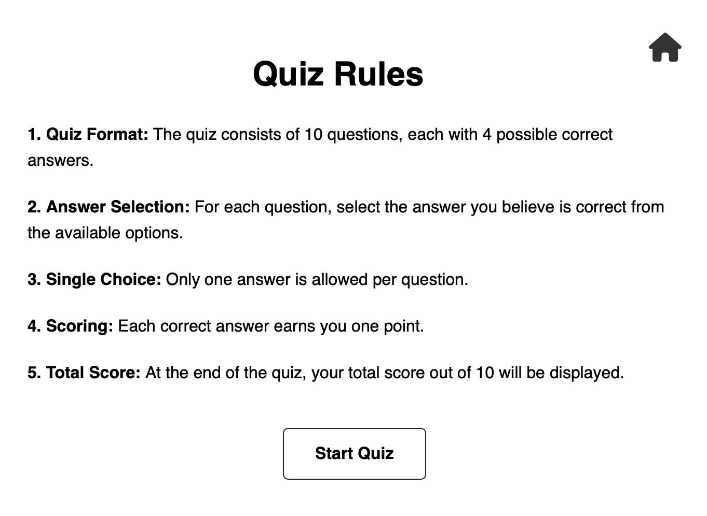
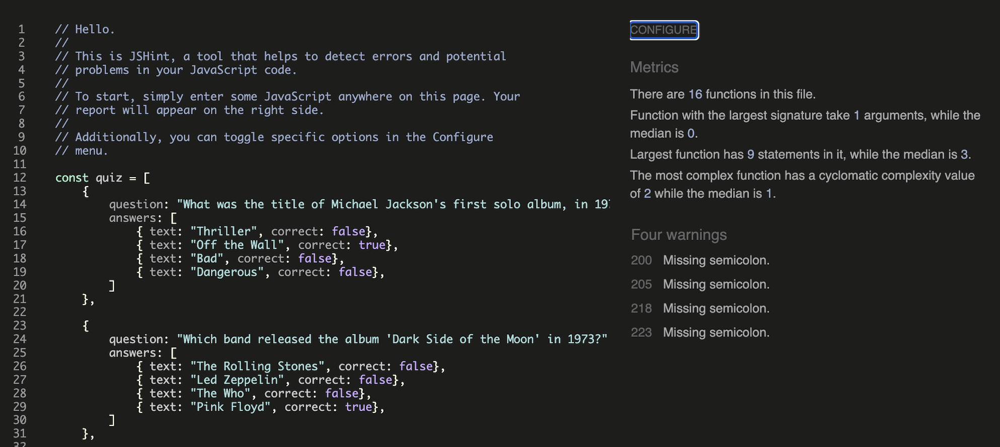
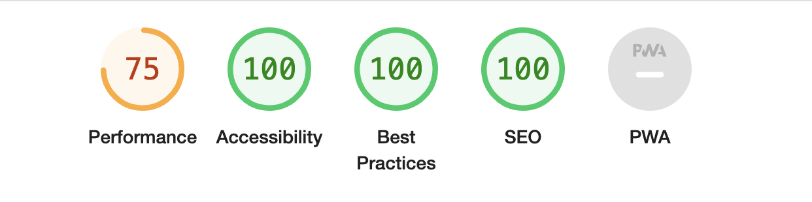

# 1970s Music Quiz 

1970s Music Quiz is an online quiz dedicated to the iconic sounds of the 1970s. Users can enjoy a fun and interactive experience by testing their knowledge of 1970s music in a quiz format. The website offers an engaging way to spend leisure time while immersing oneself in the sounds of a nostalgic era.

Visit the deployed website [here](https://alvor1991.github.io/Online-Quiz/).

## Table of Contents

1. [User Experience (UX)](#user-experience-ux)
    1. [Project Goals](#project-goals)
    2. [User Stories](#user-stories)
    3. [Color Scheme](#color-scheme)
    4. [Wireframes](#wireframes)
2. [Features](#features)
    1. [Welcome Modal](#welcome-modal)
    2. [Quiz Rules](#quiz-rules)
    3. [Music Quiz](#music-quiz)
    4. [Quiz Score](#quiz-score)
 3. [Technologies Used](#technologies-used)
    1. [Languages Used](#languages-used)
    2. [Frameworks, Libraries and Programs Used](#frameworks-libraries-and-programs-used)
4. [Testing](#testing)
    1. [Testing User Stories](#testing-user-stories)
    2. [Code Validation](#code-validation)
    3. [Accessibility](#accessibility)
    4. [Tools Testing](#tools-testing)
    5. [Manual Testing](#manual-testing)
5. [Finished Product](#finished-product)
6. [Deployment](#deployment)
    1. [GitHub Pages](#github-pages)
7. [Credits](#credits)
    1. [Content](#content)
    2. [Media](#media)
    3. [Code](#code)
8. [Acknowledgements](#acknowledgements)

***

## User Experience (UX)

### Project Goals

* Celebrate 1970s music - immerse users in the vibrant and iconic music of the 1970s, showcasing its cultural significance and diversity.

* Offer an engaging quiz experience - create a fun and interactive quiz format that challenges users' knowledge while providing entertainment and nostalgia.

* Ensure seamless navigation - design a user-friendly interface that allows effortless movement between quiz questions.

### User Stories

* As a user, I want to seamlessly navigate the music quiz and test my knowledge of 1970s music.

* As a user, I want engaging & challenging quiz questions that provide an enjoyable experience & stimulate my curiosity about 1970s music.

* As a user, I want clear instructions on how to play the quiz and understand the rules, ensuring a smooth and frustration-free experience.

### Color Scheme

The color scheme for the quiz interface features a green background wallpaper, creating a visually appealing backdrop for the quiz content. The quiz itself is presented within a white modal, providing a clean and focused environment for users to engage with the questions. To ensure readability and clarity, black text is employed within the modal, offering a stark contrast against the white background.

In the feedback system, red colors (#e56d6d) are utilized to indicate incorrect scores, drawing attention to areas where users may need improvement or further review. Conversely, green colors (#83d5a3) are employed to signify correct scores, offering positive reinforcement and highlighting successful responses.

Overall, this color scheme prioritizes clarity, readability, and user engagement, enhancing the overall experience.

### Wireframes

[Balsamiq](https://balsamiq.com/) was used to create a layout of the website in the planning phase. Here are my initial layout designs. As you will see in the features section, I have since added a progress bar and a score counter and home icon buttons. It is a simple design that will also look similar on mobile.  

Page | Desktop Version
--- | ---
Welcome Modal |  
Quiz Rules |  
Quiz |  
Quiz Score | 

[Back to top ⇧](#music-quiz)

## Features

Here are the main features of my website and the value they bring to users. Each feature within the quiz interface serves a distinct purpose, collectively enhancing user engagement & satisfaction. From the informative Quiz Intro to the interactive Answer Colour feedback, each element contributes to a seamless & enjoyable quiz experience. 

### Welcome Modal

* **Quiz Intro**

    - The Quiz Intro feature serves as an informative gateway, offering users a glimpse into the purpose and structure of the quiz. By providing clear insights into what users can expect, it sets the stage for an engaging and rewarding experience. This introductory informs users about the quiz's objectives but also instills a sense of anticipation, encouraging active participation. 

* **Navigation Buttons**

    - The Navigation Buttons provide users with clear and accessible options to either start the quiz or view quiz rules. This straightforward design element ensures ease of use and navigation throughout the quiz experience. By offering intuitive choices, users can quickly progress through the quiz or seek additional information as needed, enhancing overall usability and engagement.  

### Quiz Rules

    - The Quiz Rules feature offers clear instructions on how the quiz works, ensuring users understand the mechanics and objectives before they begin. By providing concise and accessible guidelines, it sets expectations and helps users navigate the quiz effectively. This feature enhances user comprehension and minimizes confusion, thereby optimizing the overall user experience. 

### Music Quiz

* **Progress Bar**

    - The Progress Bar feature is a visual indicator of user advancement through the quiz, offering a sense of direction and accomplishment. By tracking progress in real-time, users are engaged and motivated to continue until completion. This feature enhances user experience by providing a clear sense of where they are in the quiz. With a visual representation of progress, users are more likely to stay engaged, resulting in a more fulfilling and satisfying quiz experience overall.

* **Answer Colour**

    - The Answer Colour feature provides immediate feedback on user responses, highlighting correct answers in green and incorrect ones in red. This instant visual cue not only helps users understand their performance but also encourages learning through trial and error. By offering clear and concise feedback, the feature enhances user engagement, fosters a deeper understanding of the quiz content, and promotes a sense of progression as users navigate through the questions. 

* **Score Counter**

    - The Score Counter feature serves as a vital component in enhancing user engagement and motivation throughout the quiz experience. By dynamically updating in real-time as users progress through the quiz, it provides immediate feedback on their performance, reinforcing their sense of accomplishment and investment in the activity. The visual representation of the score offers users a clear indication of their current standing, while stimulating a sense of progression and achievement.

### Quiz Score 

The Quiz Score feature adds significant value to the overall user experience by providing personalized feedback based on the user's performance in the quiz. It not only serves as a means of gauging their success but also offers encouragement and motivation to play the quiz again. By categorizing scores into different levels such as "OK," "Good," "Great," and "Perfect," this feature effectively communicates to users where they stand relative to their peers and their own potential. Moreover, it creates a sense of achievement and progress.

* **OK Score (less than 5)**

    - If the user scores less than 5, this message will display.

* **Good Score (5 or above)**

    - If the user scores 5 or above, this message will display.

* **Great Score (7 or above)**

    - If the user scores 7 or above, this message will display.

* **Perfect Score (10)**

    - A perfect score of 10 will display this message.

[Back to top ⇧](#music-quiz)

## Technologies Used

### Languages Used
* [HTML5](https://en.wikipedia.org/wiki/HTML5)
* [CSS3](https://en.wikipedia.org/wiki/CSS)
* [JavaScript](https://en.wikipedia.org/wiki/JavaScript)

### Frameworks, Libraries and Programs Used

* [Font Awesome](https://fontawesome.com/)
    - Font Awesome was used to add icons and create a better visual experience for UX purposes.

* [GitPod](https://www.gitpod.io)
    - GitPod was used for writing code, committing, and then pushing to GitHub.

* [GitHub](https://github.com/)
    - GitHub was used to store the project after pushing.

* [Balsamiq](https://balsamiq.com/)
    - Balsamiq was used to create the wireframes during the design phase of the project.

* [Am I Responsive?](http://ami.responsivedesign.is/)
    - Am I Responsive was used to generate a mockup image of the website.

* [Responsive Design Checker](https://www.responsivedesignchecker.com/)
    - Responsive Design Checker was used to check responsiveness on various devices.

* [Chrome DevTools](https://developer.chrome.com/docs/devtools/)
    - Chrome DevTools was used during the development process for code review & test responsiveness.

* [W3C Markup Validator](https://validator.w3.org/)
    - W3C Markup Validator was used to validate the HTML code.

* [W3C CSS Validator](https://jigsaw.w3.org/css-validator/)
    - W3C CSS Validator was used to validate the CSS code.

* [JSHint](https://jshint.com)
    - JSHint was used to validate the JavaScript code.

[Back to top ⇧](#music-quiz)

## Testing

### Testing User Stories

* As a user, I want to seamlessly navigate the music quiz and test my knowledge of 1970s music.

    - The quiz offers a clear and simple layout for users to navigate through each question.

* As a user, I want engaging and challenging quiz questions that provide an enjoyable experience.

    - The quiz contains 4 possible answers, which makes the questions challenging.

* As a user, I want clear instructions on how to play the quiz and understand the rules.

    - The quiz rules are simple and listed in clear bullet points. 

* As a user, I want to easily find my final quiz score.

    - The quiz displays the user's score clearly at the end of the quiz.

    - A score counter displays throughout the quiz.

### Code Validation

* The [W3C Markup Validator](https://validator.w3.org/), [W3C CSS Validator](https://jigsaw.w3.org/css-validator/) and [JSHint](https://jshint.com) services were used to validate all pages of the project to ensure there were no syntax errors.

    - W3C Markup Validator found errors found errors regarding duplicate ID values for the home button icon. I replaced these IDs with classes.
    
    - W3C CSS Validator found no errors or warnings on my CSS.

    - JSHint identified missing semicolons and warned about the usage of const and let, which are features introduced in ES6.

    

### Accessibility

* Used Lighthouse in Chrome DevTools to confirm that colors and fonts used are easy to read and accessible.

    

### Tools Testing

* [Chrome DevTools](https://developer.chrome.com/docs/devtools/) was used during the development process to test, explore and modify HTML, CSS and Javascript elements used in the project.

* [Am I Responsive?](http://ami.responsivedesign.is/#) was used to check responsiveness of the site pages across different devices.

* [Responsive Design Checker](https://www.responsivedesignchecker.com/) was used to check responsiveness on different screen sizes.
    

### Manual Testing

* Browser Compatibility

    - The website has been tested on the following browsers:

        - Google Chrome, Safari and Mozilla Firefox
        
        No appearance, responsiveness or functionality issues.

* Device Compatibility

    - The website has been tested on multiple devices, including:

        - MacBook Air, iMac20, iPhone 12 and iPhone 11

        No appearance, responsiveness or functionality issues.

* Common Elements Testing

 #### Welcome Modal
TEST            | OUTCOME                          | PASS / FAIL  
--------------- | -------------------------------- | ---------------
Start Quiz | Clicking on the Start Quiz button will bring the user to the Music Quiz.| PASS
Quiz Rules | Clicking on the Quiz Rules button will bring the user to the Quiz Rules Modal.| PASS

 #### Quiz Rules
TEST            | OUTCOME                          | PASS / FAIL  
--------------- | -------------------------------- | ---------------
Start Quiz | Clicking on the Start Quiz button will bring the user to the Music Quiz.| PASS
Home Icon| Clicking on the home icon button will bring the user back to the Welcome Modal.| PASS

 #### Music Quiz
TEST            | OUTCOME                          | PASS / FAIL  
--------------- | -------------------------------- | ---------------
Click Answer | Clicking an answer will highlight the correct (green) and incorrect (red) answers for that question.| PASS
Post click answer | Once an answer is selected, all other answers will be disabled and a Next button will appear.| PASS
Next Button | Clicking on the Next button will bring the user to the next question.| PASS
Progress Bar | The progress bar updates as each question is completed.| PASS
Score Counter | The score counter updates as each question is completed.| PASS
Home Icon | Clicking on the home icon button will bring the user back to the Welcome Modal.| PASS
Title Change | Once user moves to question 2, the quiz title will change from 'Let the Quiz Begin!' to 'Music Quiz'.| PASS

 #### Quiz Score
TEST            | OUTCOME                          | PASS / FAIL  
--------------- | -------------------------------- | ---------------
Quiz Score | The user's score is displayed once user completes the quiz.| PASS
Progress Bar| The progress bar is full.| PASS
Play Again| Clicking on the Play Again button will bring the user back to the start of the quiz.| PASS
Home Icon| Clicking on the home icon button will bring the user back to the Welcome Modal.| PASS

[Back to top ⇧](#music-quiz)

## Finished Product

Page | Desktop version | Mobile version
--- | --- | ---
Welcome Modal |  | 
Quiz Rules |  | 
Quiz Begin |  | 
Quiz Progress |  | 
Quiz Score |  | 

[Back to top ⇧](#music-quiz)

## Deployment

* This website was developed using [Gitpod](https://www.gitpod.io), then committed and pushed to GitHub using VS Code.

### GitHub Pages

* Here are the steps to deploy this website to GitHub Pages from its GitHub repository:

    1. Log in to GitHub and locate the [GitHub Repository](https://github.com/).

    2. At the top of the Repository, locate the Settings button on the menu.

        - Alternatively click [here](https://raw.githubusercontent.com/) for a GIF demostration of the process.

    3. Scroll down the Settings page until you locate the Pages section.

    4. Under Source, click the dropdown called None and select Master Branch.

    5. The page will refresh automatically and generate a link to your website.

[Back to top ⇧](#music-quiz)

## Credits 

### Content

- My previous README.md file structure was used as a reference for this project.

- Quiz page design, some CSS style and JavaScript code was taken and modifed from (https://www.youtube.com/watch?v=PBcqGxrr9g8)

### Media

* [Freepik](https://www.freepik.com)

    - Music background image is from Freepik.

### Code

* [W3Schools](https://www.w3schools.com/) was consulted on a regular basis for inspiration.

[Back to top ⇧](#music-quiz)

## Acknowledgements

* Code Institute and the Slack community for their support, knowledge and feedback.

* My tutor, Marcel, for his invaluable feedback and guidance.

[Back to top ⇧](#music-quiz)
