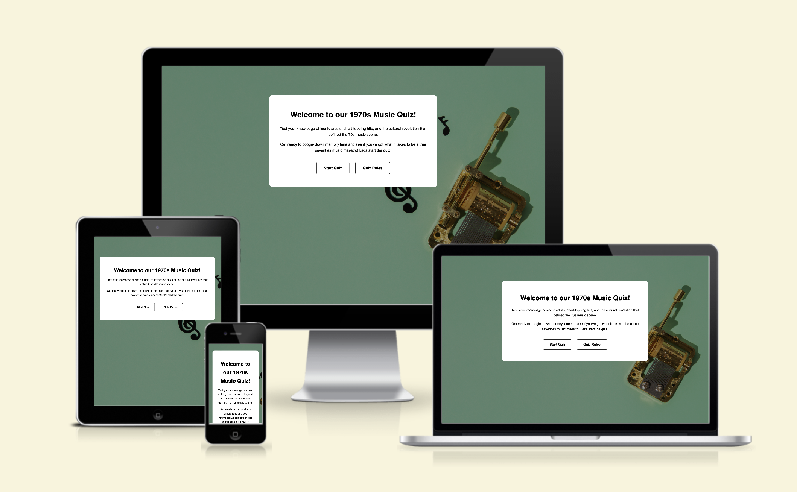
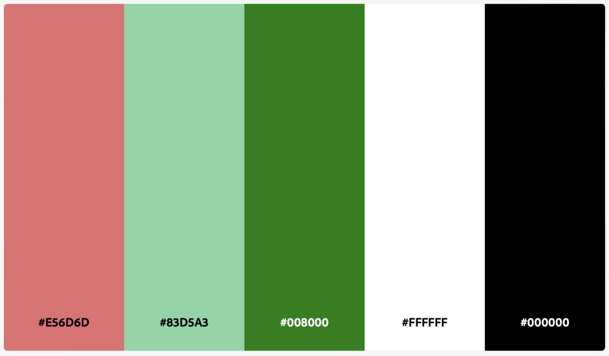

# Music Quiz 

Las Tacos is a fictional Mexican restaurant located in the heart of Cork city. Las Tacos offers an authentic Mexican dining experience. The food is a modern twist on time-honoured recipes. The cocktails are a fusion of traditional Mexican spirits and contemporary flavours.

The purpose of this website is to promote Las Tacos and to provide information to customers about the restaurant, its menu and contact options. The website targets an audience of customers who enjoy Mexican food in a causal dining experience.

Visit the deployed website [here](https://alvor1991.github.io/Las-Tacos-PP1/).

## Table of Contents

1. [User Experience (UX)](#user-experience-ux)
    1. [Project Goals](#project-goals)
    2. [User Stories](#user-stories)
    3. [Color Scheme](#color-scheme)
    4. [Typography](#typography)
    5. [Wireframes](#wireframes)
2. [Features](#features)
    1. [General](#general)
    2. [Landing Page](#landing-page)
    3. [Menu Page](#menu-page)
    4. [Contact Page](#contact-page)
 3. [Technologies Used](#technologies-used)
    1. [Languages Used](#languages-used)
    2. [Frameworks, Libraries and Programs Used](#frameworks-libraries-and-programs-used)
4. [Testing](#testing)
    1. [Testing User Stories](#testing-user-stories)
    2. [Code Validation](#code-validation)
    3. [Accessibility](#accessibility)
    4. [Tools Testing](#tools-testing)
    5. [Manual Testing](#manual-testing)
5. [Finished Product](#finished-product)
6. [Deployment](#deployment)
    1. [GitHub Pages](#github-pages)
7. [Credits](#credits)
    1. [Content](#content)
    2. [Media](#media)
    3. [Code](#code)
8. [Acknowledgements](#acknowledgements)

***

## User Experience (UX)

### Project Goals

* Celebrate 1970s music - immerse users in the vibrant and iconic music of the 1970s, showcasing its cultural significance and diversity.

* Offer an engaging quiz experience - create a fun and interactive quiz format that challenges users' knowledge while providing entertainment and nostalgia.

* Ensure seamless navigation - design a user-friendly interface that allows effortless movement between quiz questions and other website sections.

### User Stories

* As a user, I want to seamlessly navigate the website to access the music quiz and test my knowledge of 1970s music.

* As a user, I want engaging and challenging quiz questions that provide an enjoyable experience and stimulate my curiosity about 1970s music.

* As a user, I want clear instructions on how to play the quiz and understand the rules, ensuring a smooth and frustration-free experience.

### Color Scheme

The colors used in the site are red (#784742), yellow (#E5B87B), two shades of green (#56733C and #FAFCF7) and the colour white for the main background. These colours represent Cinco de Mayo, a celebration of Mexico. I recreated the Mexican flag in the navigation bar and footer elements. A shade of gold is used instead of white, as I wanted the colour to stand out more against a light clean background. For the menu section, the left side is red and the right side is green, consistent with the Las Tacos logo. The desserts heading is in gold to give the menu the complete colour selection and highlight desserts as an indulgent and luxury item.

### Typography

I want the site to have both an authentic and modern feel. Amatic SC is used for the headings, which gives the site a friendly and informal vibe. It evokes a sense of traditional Mexican art, adding a touch of authenticity to the site. It is also used for the logo, reinforcing the Las Tacos brand. The main font used in the site is Lato, with Sans Serif as the fallback font in case Lato is not being imported correctly. The combination of Amatic SC and Lato creates a cohesive visual identity. 

### Wireframes

[Balsamiq](https://balsamiq.com/) was used to create a layout of the website in the planning phase. Here are my initial designs for the layout. 

Page | Desktop Version | Mobile Version
--- | --- | ---
Index |  | 
Menu |  | 
Contact |  | 

[Back to top ⇧](#music-quiz)

## Features

### General

* Responsive design across all device sizes.

* Similar color scheme and design throughout all pages to effectively structure, categorise and present the information to users.

* **Header**

    
    - The header contains the business logo and fully responsive navigation bar positioned across the top of the screen.

    - The business logo functions as a link to the landing page.

    - The navigation bar is identical in all pages and contains links to all pages to facilitate navigation across the site. It also has a hover effect that changes color to keep with the colour scheme.

    - The navigation bar will collapse on mobile and offer a toggle feature for customers, as shown below.

* **Footer**

    - The footer includes a smaller version of the logo and link to the business' social media channels.

### Welcome Modal

* **Hero Image**

    - The hero image is designed to attract the customer's attention with a fresh and modern look.

* **Info Section**

    - Contains a welcome heading and welcome statement. This section communicates the essence of the site and entices customers to explore more about the unique culinary offerings.

* **Intro Section**

    - Provides a glimpse into the history, mission, and the unique experience that the business offers. It also provides an option to book a reservation or view the food and cocktails menu. 

* **Image Section**

    - Contains images, giving the customer a taste of what Mexican food and cocktails the business has to offer. Each image is fully responsive and provides a link to the menu page.

### Quiz Rules Modal

* **Food Section**

    - This section provides customers with all the food items available.  

    - The food section is fully responsive and easy to replicate in case more food items need to be added.

* **Cocktail Section**

    - This section provides customers with all the cocktails items available.  

    - The food section is fully responsive and easy to replicate in case more cocktail items need to be added.

### Music Quiz

* **Contact Section**

    - The form allows customers to book a reservation on a specific date directly from the business' website.
    
    - The map displays a Google map of the business' geographical location. This allows customers to easily find the location from their devices.

[Back to top ⇧](#music-quiz)

## Technologies Used

### Languages Used
* [HTML5](https://en.wikipedia.org/wiki/HTML5)
* [CSS3](https://en.wikipedia.org/wiki/CSS)
* [CSS3](https://en.wikipedia.org/wiki/JavaScript)

### Frameworks, Libraries and Programs Used

* [Google Fonts](https://fonts.google.com/)
    - Google Fonts was used to import the fonts Amatic SC and Lato into the style.css file. These fonts were used throughout the site.

* [Font Awesome](https://fontawesome.com/)
     - Font Awesome was used throughout all pages to add icons in order to create a better visual experience for UX purposes.

* [GitPod](https://www.gitpod.io)
     - GitPod was used for writing code, committing, and then pushing to GitHub.

* [GitHub](https://github.com/)
     - GitHub was used to store the project after pushing.

* [Balsamiq](https://balsamiq.com/)
     - Balsamiq was used to create the wireframes during the design phase of the project.

* [Am I Responsive?](http://ami.responsivedesign.is/)
    - Am I Responsive was used in order to see responsive design throughout the process and to generate mockup imagery to be used.

* [Responsive Design Checker](https://www.responsivedesignchecker.com/)
    - Responsive Design Checker was used in the testing process to check responsiveness on various devices.

* [Chrome DevTools](https://developer.chrome.com/docs/devtools/)
    - Chrome DevTools was used during development process for code review and to test responsiveness.

* [W3C Markup Validator](https://validator.w3.org/)
    - W3C Markup Validator was used to validate the HTML code.

* [W3C CSS Validator](https://jigsaw.w3.org/css-validator/)
    - W3C CSS Validator was used to validate the CSS code.

* [JSHint](https://jshint.com)
    - W3C CSS Validator was used to validate the CSS code.

[Back to top ⇧](#music-quiz)

## Testing

### Testing User Stories

* As a user, I want to seamlessly navigate the music quiz and test my knowledge of 1970s music.

    - The quiz offers a clear and simple layout for users to navigate through each question.

* As a user, I want engaging and challenging quiz questions that provide an enjoyable experience.

    - The quiz contains 4 possible answers, which makes the questions challenging.

* As a user, I want clear instructions on how to play the quiz and understand the rules.

    - The quiz rules are simple and listed in clear bullet points. 

* As a user, I want to easily find my final quiz score.

    - The quiz displays the user's score clearly at the end of the quiz.

    - A score counter displays throughout the quiz.

### Code Validation

* The [W3C Markup Validator](https://validator.w3.org/), [W3C CSS Validator](https://jigsaw.w3.org/css-validator/) and [JSHint](https://jshint.com) services were used to validate all pages of the project in order to ensure there were no syntax errors.

    - On the Home page, the W3C Markup Validator found errors concerning headings not being included on the hero section, the intro section and the image section. The hero section tags and image section tags were replaced with divs. The intro section h1 element was replaced with a h2 element.

    - On the Menu page, the W3C Markup Validator found errors regarding duplicate ID values for section tags. I replaced these IDs with classes. Another error was found concerning h1 element to be used as a top-level heading only. I replaced this with a h2 element.

    - On the Contact page, the W3C Markup Validator found errors concerning the iframe - a bad value of 100% for attribute width. Removed html iframe styling and replaced the same values in custom CSS. 
    
    - W3C CSS Validator found no errors or warnings on my CSS.

### Accessibility

* Used Lighthouse in Chrome DevTools to confirm that colours and fonts used throughout the website are easy to read and accessible.

* Lighthouse reports

    - **Landing Page**

    

    - **Menu Page**

    

    - **Contact Page**

    

### Tools Testing

* [Chrome DevTools](https://developer.chrome.com/docs/devtools/)

    - Chrome DevTools was used during the development process to test, explore and modify HTML, CSS and Javascript elements used in the project.

* Responsiveness
    
    - [Am I Responsive?](http://ami.responsivedesign.is/#) was used to check responsiveness of the site pages across different devices.

    - [Responsive Design Checker](https://www.responsivedesignchecker.com/) was used to check responsiveness on different screen sizes.
    
    - Chrome DevTools was used to test responsiveness in different screen sizes during development.

### Manual Testing

* Browser Compatibility

    - The website has been tested on the following browsers:

        - **Goolgle Chrome**
        
        No appearance, responsiveness or functionality issues.

        - **Safari**
        
        No appearance, responsiveness or functionality issues.

        - **Mozilla Firefox**
        
        No appearance, responsiveness or functionality issues.

* Device compatibility

    - The website has been tested on multiple devices, including:

        - **MacBook Air"**

        No appearance, responsiveness nor functionality issues.

        - **iMac20,1**

        No appearance, responsiveness nor functionality issues.

         - **iPhone 12**

        No appearance, responsiveness nor functionality issues.

        - **iPhone 11**

        No appearance, responsiveness nor functionality issues.

* Common Elements Testing

    - **Welcome Modal**

        - Clicking on the Start Quiz button will bring the user to the Music Quiz.

        - Clicking on the Quiz Rules button will bring the user to the Quiz Rules Modal.

        - Hovering over either of these buttons will trigger a hover effect.

    - **Quiz Rules Modal**

        - Clicking on the Start Quiz button will bring the user to the Music Quiz.

        - Clicking on the home icon button will bring the user back to the Welcome Modal.

        - Hovering over either of these buttons will trigger a hover effect.

    - **Music Quiz**

        - Clicking an answer will highlight the correct (green) and incorrect (red) answers for that question.

        - Once an answer is selected users will be unable to select or change their answer. 

        - Once an answer is selected, a Next button appears at the bottom of the quiz. 

        - Clicking on the Next button will bring the user to the next question.

        - The progress bar updates as each question is completed. 

        - The score counter updates as each question is completed. 

        - Clicking on the home icon button will bring the user back to the Welcome Modal.

    - **User Score**

        - The user's score is displayed once user completes the quiz.
        
        - The progress bar is full. 

        - Clicking on the Play Again button will bring the user back to the start of the quiz.
        
        - Clicking on the home icon button will bring the user back to the Welcome Modal.

[Back to top ⇧](#music-quiz)

## Finished Product

Page | Desktop version | Mobile version
--- | --- | ---
Index |  | 
Menu |  | 
Contact |  | 

[Back to top ⇧](#music-quiz)

## Deployment

* This website was developed using [Gitpod](https://www.gitpod.io), which was then committed and pushed to GitHub using Visual Studio Code.

### GitHub Pages

* Here are the steps to deploy this website to GitHub Pages from its GitHub repository:

    1. Log in to GitHub and locate the [GitHub Repository](https://github.com/).

    2. At the top of the Repository, locate the Settings button on the menu.

        - Alternatively click [here](https://raw.githubusercontent.com/) for a GIF demostration of the process.

    3. Scroll down the Settings page until you locate the Pages section.

    4. Under Source, click the dropdown called None and select Master Branch.

    5. The page will refresh automatically and generate a link to your website.

[Back to top ⇧](#music-quiz)

## Credits 

### Content

- My previous README.md file structure was used as a reference for this project.

- Quiz page design, some CSS style and Javascript code was taken and modifed from (https://www.youtube.com/watch?v=PBcqGxrr9g8)

### Media

* [Pexels](https://www.pexels.com/)

    - Hero image: "mexican tacos on the wooden board" by Roman Odinstov.
    - Image section cocktail-1 image: "glass of cold cocktail with orange" taken by Charlotte May.
    - Image section tacos-3 image: "mexican tacos with salsa" taken by Roman Odinstov.
    - Image section cocktail-2 image: "clear drinking glass with yellow liquid" taken by cottonbro studio.
    - Image section tacos-3 image: "clear drinking glass with yellow liquid" taken by Roman Odinstov.

### Code

* [W3Schools](https://www.w3schools.com/) was consulted on a regular basis for inspiration.

[Back to top ⇧](#music-quiz)

## Acknowledgements

* Code Institute and the Slack community for their support, knowledge and feedback.

* My tutor, Marcel, for his invaluable feedback and guidance.

[Back to top ⇧](#music-quiz)
